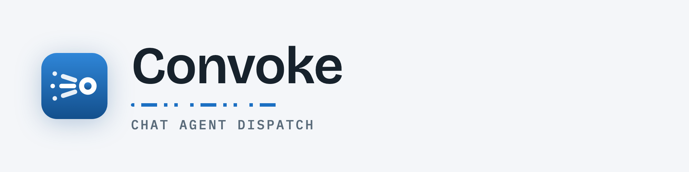
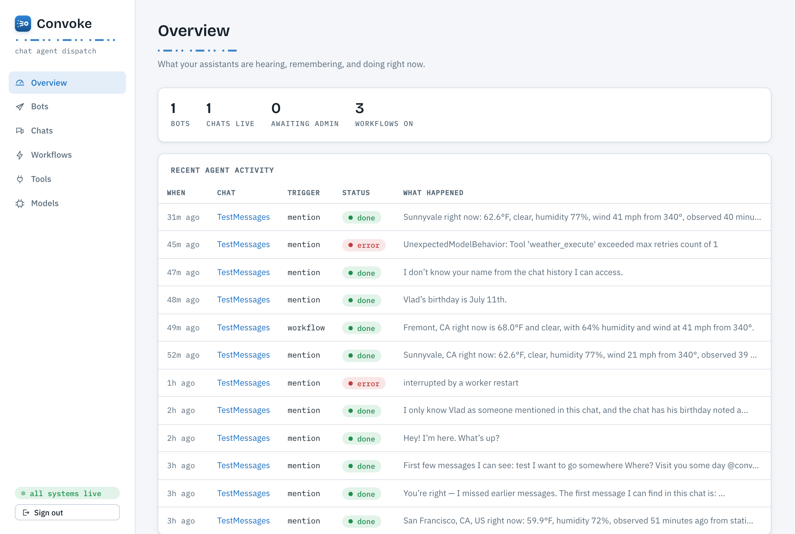
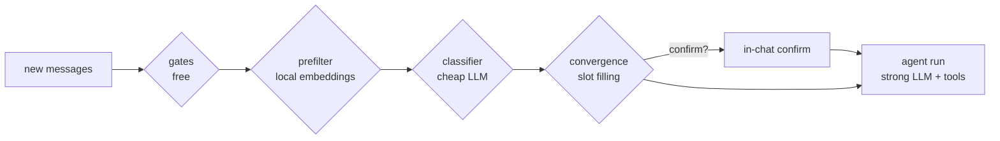

<p align="center">
  
</p>

<p align="center">
  <em>Orchestrate Telegram chat agents by intent, schedule, and shared memory.</em>
</p>

<p align="center">
  
  
  
  
  
  
</p>

---

Convoke is a **self-hosted** platform where you connect Telegram bots you own to group
chats. Each chat becomes the assistant's persistent, searchable memory, and **workflows**
let it act on its own — on a schedule, or the moment a conversation converges on an intent
(*"they've agreed on dinner Tuesday 7pm → create the calendar event"*). Bring your own
models; nothing leaves your machine unless you point it there.

<p align="center">
  
</p>

## Features

- 🧠 **Memory cortex** — every message is stored, chunked into conversation segments, and
  embedded locally (`multilingual-e5-small`, pgvector). The agent searches full history
  semantically, keeps distilled notes, and always sees recent messages verbatim.
- 📷 **Media understanding** — photos, voice notes, videos, and stickers become searchable
  text at ingest: a vision model describes images (visible text quoted verbatim), a
  whisper-compatible endpoint transcribes audio, video falls back to thumbnail + sampled
  frames + transcript. Bytes are never stored — only the descriptions. A photo of movie
  tickets can trigger a "schedule an event" workflow by itself.
- 💬 **Answers on mention / reply** — @mention the bot or reply to it; it responds with
  full memory and the chat's tools. Powered by [Pydantic AI](https://ai.pydantic.dev).
- ⚡ **Intent workflows** — plain-text triggers evaluated continuously and *cheaply*:
  free gates → embedding prefilter → cheap-LLM classifier → slot-filling convergence →
  optional in-chat confirmation before acting.
- ⏰ **Scheduled workflows** — cron-triggered agent actions, per chat.
- 🔌 **MCP tools** — register streamable-HTTP or stdio [MCP](https://modelcontextprotocol.io)
  servers, enable them per chat; OAuth-protected servers connect with a one-time browser
  sign-in (discovery, PKCE, automatic token refresh).
- 🎛️ **Bring your own models** — a library of OpenAI-compatible endpoints (Ollama, LM
  Studio, OpenRouter, OpenAI…) with auto-detected capabilities, assigned per role:
  `agent`, a cheap `intent` classifier, `vision`, `transcription`, and optional
  video-native.
- 🕰️ **History import** — bots can't read messages sent before they joined, so Convoke
  ingests a Telegram Desktop export (bare JSON or the full ZIP with media), validated
  against live history before it's trusted.

## Quick start

```bash
cp .env.example .env    # then fill in the three secrets (comments inside)
docker compose up -d
open http://localhost:8080
```

Sign in with `CONVOKE_OPERATOR_PASSWORD`, then:

1. **Models** — connect an OpenAI-compatible endpoint to the library (capabilities are
   probed on test), then assign it to the `agent` role — and optionally `intent`,
   `vision`, and `transcription` for media understanding. From Docker, a service on
   your host is `http://host.docker.internal:11434/v1` (Ollama example).
2. **Bots** — create a bot with [@BotFather](https://t.me/BotFather), paste its token.
   **Important:** run `/setprivacy` → **Disable**, or the bot only sees mentions and its
   memory stays empty. Convoke warns you until this is right.
3. Add the bot to a group. It posts an **"Authorize Convoke"** button — a chat admin taps
   it (verified at click time). From that moment, messages are ingested.
4. *(Optional)* Import history, and create **workflows** assigned to chats.

📖 **Walkthroughs:** [`examples/events.md`](examples/events.md) builds an event-scheduling
bot end-to-end; [`examples/weather-mcp.md`](examples/weather-mcp.md) adds a weather tool.

## How it works

Four containers — `frontend` (nginx + React), `backend` (FastAPI, singleton), `worker`
(all the loops, singleton), `db` (Postgres 17 + pgvector). **Postgres is the only
datastore**, including the work queues.

The load-bearing pattern is a **transactional inbox**: each bot's `getUpdates` loop does
exactly one thing — persist raw updates, commit, then advance the Telegram offset.
Everything downstream (ingestion, embedding, intent evaluation, agent runs) is a DB-driven
consumer, so a crash never loses data.

The other half of the design is coping with what Telegram *won't* tell you:

| Platform reality | Convoke's answer |
| --- | --- |
| Bots can't fetch history, ever | Export upload + validation scorecard |
| Privacy mode hides group messages | `getMe` check + hard warning in the UI |
| Updates kept only 24h server-side | Downtime gaps recorded, shown in UI and to the agent |
| Bots never see other bots' messages (incl. own) | Outbound replies persisted at send time |
| Deletions are never delivered | Operator "forget" tooling (sender / range / chat) |
| ~1 msg/s per chat, 20/min per group | Central token-bucket limiter on all sends |

The intent pipeline is a **cost funnel** — each stage is ~10–100× cheaper than the next, so
continuous listening is nearly free and the strong model runs only on a real trigger:



## Development

```bash
# backend — unit tests, sqlite-backed
cd backend && uv sync && uv run pytest

# frontend — Vite dev server, proxies /api to :8000
cd frontend && npm install && npm run dev

# the real thing — backend runs migrations on start
docker compose up -d --build
```

**Stack & why:** aiogram (typed Bot API client), Pydantic AI (agent harness, structured
output, MCP), local sentence-transformers embeddings, Postgres + pgvector (rows, vectors,
*and* queues in one store), a hand-rolled scheduler (`next_fire_at` + croniter), FastAPI +
async SQLAlchemy + Alembic, React + TypeScript + Vite. Secrets are Fernet-encrypted at rest.

## License

[MIT](LICENSE).
